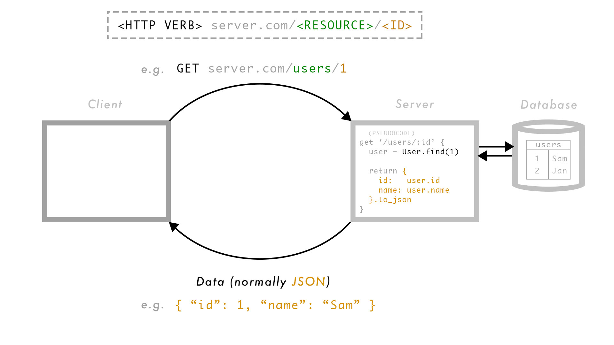

# Representational state transfer (REST)

REST is a software architectural style that is used to build web applications. You could, and someone did, write a PhD thesis on the topic but its everday use can be covered in a single workshop or practical.

## Learning outcomes

- Describe REST as a convention for routing
- Define 'Resource' in REST
- Explain a RESTful route structure
- Build a RESTful API

## Exercises

If you're doing this as a practical, rather than a workshop, you'll need to combine the resources here with your own independent research. As always, be careful to strike the right balance between reading and experimenting or building. Your goal is not to write another PhD thesis on REST.

- Observe the diagram below and explain what is going on, in your own words.
- Look back at the learning outcomes and make sure your explanation covers each of the first three.
- Write down your explanation and share it with a peer for feedabck.
- Build a RESTful API that serves the data in data.json. You can use Sinatra, Node, or something else.

### RESTful schema

| CRUD action  | RESTful route  | REST name  |
|---|---|---|
| Create  | POST server.com/users/  | Create  |
| Read  | GET server.com/users/  | Index  |
|   | GET server.com/users/1  | Show  |
| Update  | PUT server.com/users/1  | Update  |
| Delete  | DELETE server.com/users/1  | Delete  |

### RESTful flow

